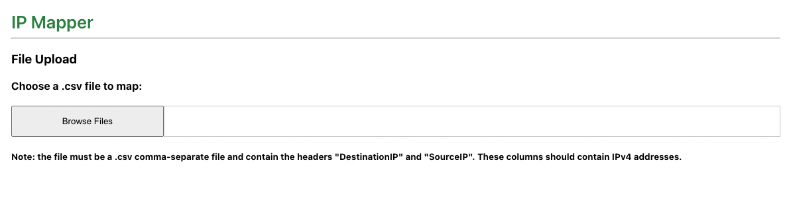
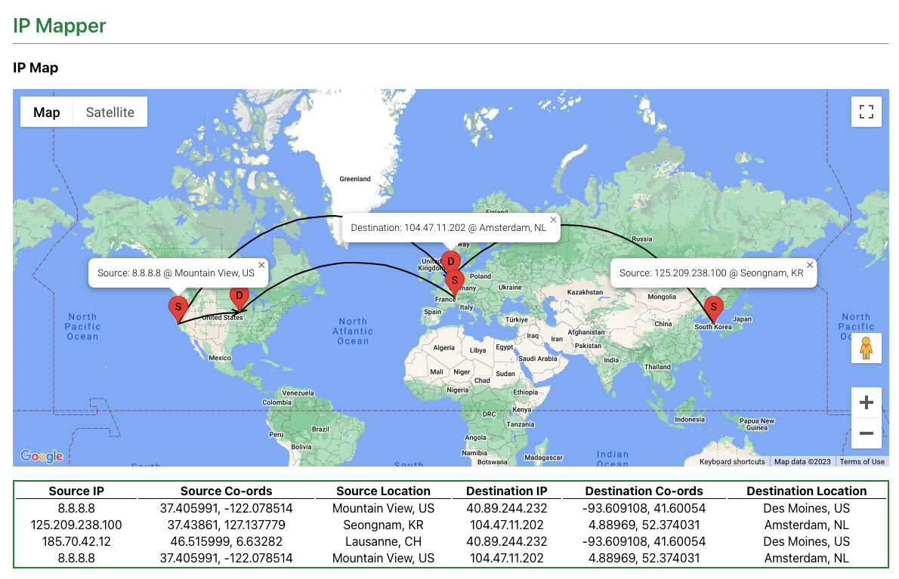

# React IP Mapper
IP Mapper renders a map showing allows users to select a .csv file containing IP address data from their local machine an The app sends users a message via Slack with a summary of information about a movie retrieved from <a href="https://www.themoviedb.org/documentation/api" target="_blank">TMDB API</a>.

### Pre-requisites
- A Google Maps API Key is required. See <a href="https://developers.google.com/maps/documentation/javascript/get-api-key" target="_blank">Use API Keys</a> for more information.
- The APILayer IP to Location API is used to retrieve location information for IPs. See <a href="https://apilayer.com/marketplace/ip_to_location-api" target="_blank">APILayer Info</a> for more information.

## Setup
Clone this repository.

This app uses `dotenv-webpack` module to load authentication keys. Create a `.env` file within root directory of project with the following variables:
```
REACT_APP_GOOGLE_MAP_API_KEY="<Insert your Google Maps API Key here>"
REACT_APP_APILAYER_KEY="<Insert your APILayer API Key here>"
```

Open project directory in terminal and run the following:
```bash
npm install

npm start
```
This will run the app on `http://localhost:3000`.

## Walkthrough

When the app launches you will see a screen with a `Browse Files` input allowing the user to select a .csv file from their local machine.



Once you select your .csv file, the app will render a Google Map showing the mapped Source and Destination IP address. You can click on the markers to see details about a specific location and all data is displayed in a table under the map.

 


 